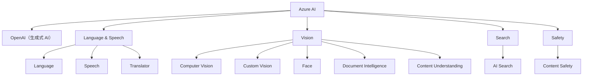

# Azure AI 服务分类总览

Azure AI 提供丰富的服务模块，覆盖语言处理、视觉感知、内容安全、搜索分析、生成式 AI 等多个领域。

---

## 🧠 生成式 AI（Azure OpenAI）

| 服务名称 | 描述 |
|----------|------|
| **Azure OpenAI 服务** | 提供对 GPT 系列大型语言模型的访问（GPT-4, GPT-3.5 等），以及 DALL·E 图像生成模型，具备生成文本、代码、图像等能力，部署在 Azure 的安全可控环境中。 |

---

## 🗣️ 语言与语音理解

| 服务名称 | 描述 |
|----------|------|
| **Azure AI 语言服务** | 提供自然语言处理能力，包括实体识别、情绪分析、文本摘要、问答系统、对话理解等。 |
| **Azure AI 语音服务** | 支持语音转文本、文本转语音、说话人识别、实时语音翻译等语音处理功能。 |
| **Azure AI 翻译器（Translator）** | 提供多语言文本翻译功能，支持上百种语言，可与语音服务结合使用，实现语音翻译。 |

---

## 👁️‍🗨️ 视觉与图像分析

| 服务名称 | 描述 |
|----------|------|
| **Azure AI 视觉服务** | 提供通用的图像识别能力，如目标检测、图像描述生成、OCR（图像文字识别）等。 |
| **Azure AI 自定义视觉** | 支持训练自定义的图像分类与对象检测模型，适用于特定场景识别需求。 |
| **Azure AI 人脸服务** | 检测、分析和识别人脸，部分功能出于安全隐私限制，仅对批准客户开放。 |
| **Azure AI 文档智能** | 从结构化或非结构化文档中提取字段（如发票、收据、表单等），支持预训练或自定义模型。 |
| **Azure AI 内容理解** | 支持从文档、图像、音频、视频等多模态内容中提取结构化数据，适用于大规模内容分析场景。 |

---

## 🔍 搜索与数据理解

| 服务名称 | 描述 |
|----------|------|
| **Azure AI 搜索服务** | 提供智能搜索能力，可通过 AI 技能从内容中提取信息并创建可搜索的索引，支持向量索引和 RAG（检索增强生成）应用。 |

---

## 🚨 内容审查与安全

| 服务名称 | 描述 |
|----------|------|
| **Azure AI 内容安全服务** | 检测文本和图像中的冒犯性、不当或有风险的内容，辅助实现内容合规审查。 |

---

## 🧩 总结图示（可选）

你可以根据以下结构绘制图示：

