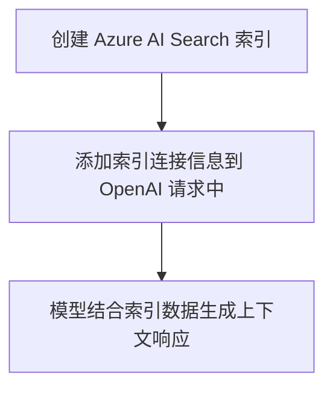

# 介绍

语言模型因其能够对用户的问题生成连贯且令人印象深刻的回答，正越来越受到欢迎。尤其是在用户通过聊天的方式与语言模型交互时，这种方式提供了一种直观的方式来获取所需的信息。

在通过聊天实现语言模型时，一个普遍存在的挑战是所谓的**靠谱程度（groundedness）**，它指的是回应是否有根有据，是否与现实或特定语境相连接。换句话说，扎根性表示语言模型的回应是否基于真实的信息。

## 缺乏依据的提示和回复

当你使用语言模型根据提示词生成回答时，模型所依据的信息仅来自其训练数据 —— 这些数据往往只是来自互联网或其他来源的大量无上下文的文本。
这通常只是从互联网或其他来源来的大量没有上下文的文字内容。


这样的回答通常在语法上是连贯且逻辑合理的，但由于不基于相关的真实数据，它缺乏上下文支持，因此可能是不准确的，甚至包含“虚构”的信息。例如，针对“我应该使用哪个产品来完成 X？”这个问题，模型可能会编造出一个并不存在的产品作为回答。

## 基于事实的提问与回答

相比之下，你可以用一个数据源为提示词提供相关的、真实的背景信息。然后将这个带有背景信息的提示词提交给语言模型，以生成有语境、相关性强、而且更准确的回答。


这个数据源可以是任何相关数据的存储库。例如，你可以使用产品目录数据库中的数据，为“我应该使用哪个产品来完成 X？”这个问题提供依据，使得回答中包含该目录中实际存在产品的相关信息。

在本模块中，你将学习如何通过构建一个使用你自有数据的 Agent，来创建一个具备扎根能力的聊天式语言模型应用。

## 了解如何让你的语言模型基于真实数据生成回答

语言模型擅长生成引人入胜的文本，非常适合作为智能代理（Agent）的基础。代理为用户提供一种直观的基于聊天的应用，帮助他们完成工作。在为特定应用场景设计代理时，你需要确保语言模型具备扎根性，并能使用与用户需求相关的真实信息。

尽管语言模型训练于海量数据，但它们可能无法访问你希望提供给用户的特定知识。为了确保代理基于特定数据，生成准确且贴合领域的回答，你可以使用**检索增强生成（Retrieval Augmented Generation，简称 RAG）**技术。


### 理解 RAG

RAG 是一种可以让语言模型基于事实生成回答的技术。换句话说，它是一种根据用户最初的提示词检索相关信息的过程。一般而言，RAG 模式包括以下几个步骤：
1.根据用户输入的初始提示词检索真实数据；
2.用检索到的真实数据增强提示词内容；
3.利用语言模型生成一个贴合上下文、基于事实的回答。

【1. 用户输入 Prompt】
            │
            ▼
【2. 向向量数据库 / 文档库检索相关内容】
            │
            ▼
【3. 将检索到的真实内容（Grounding Data）拼接进 Prompt】
            │
            ▼
【4. 组合后的 Prompt 一起送入大语言模型（如 GPT-4）】
            │
            ▼
【5. 大语言模型生成结合事实的回答（Grounded Answer）】

通过从指定的数据源中获取上下文信息，可以确保语言模型在回答时使用的是相关的真实资料，而不是单纯依赖它原本的训练数据。RAG 是一种简单易用且非常强大的方法，适用于希望让语言模型“有据可依”、提升生成式 AI 应用回答真实性和准确性的各种场景。

### 向 Azure AI 项目中添加参考资料

你可以使用 Azure AI Foundry 构建一个自定义智能体（agent），它会用你自己的数据来增强提示词的背景信息，让模型生成更准确的回答。包括：

1. Azure Blob 存储
2. Azure Data Lake Storage Gen2
3. Microsoft OneLake

你也可以将文件或文件夹上传到 AI Foundry 项目所使用的存储空间中。

### 让你的数据支持搜索功能

当你希望创建一个能够使用自有数据生成准确回答的智能代理时，就需要具备高效搜索这些数据的能力。在使用 Azure AI Foundry 构建代理时，你可以通过集成 Azure AI Search，在对话流程中检索相关上下文信息。

Azure AI Search 是一种“检索器（retriever）”，可以在使用 Prompt Flow 构建语言模型应用时引入。它支持你导入自己的数据、建立索引，并通过查询索引来获取所需信息。

## 使用向量搜索

虽然基于文本的索引可以提升搜索效率，但通常使用向量索引能实现更优的数据检索效果。这种索引包含了表示你数据源中文本内容的嵌入向量（embedding）。嵌入向量是一种特殊的数据表示格式，搜索引擎可以借助它更容易地找到相关信息。更具体地说，一个嵌入是由多个浮点数值组成的向量。
例如，假设你有两个文档，其内容如下：
"The children played joyfully in the park."
"Kids happily ran around the playground."

这两段文字虽然用词不同，但在语义上是相近的。通过为文本生成向量嵌入，可以用数学方式计算它们之间的语义关系。

你可以想象把这些文档中的关键词提取出来，并在一个多维空间中以向量形式表示：

（此处为“向量嵌入图示”）

不同向量之间的距离可以通过计算它们夹角的余弦值来衡量，这被称为余弦相似度（cosine similarity）。换句话说，余弦相似度可用于衡量文档与查询之间的语义相似性。

通过用向量表示词语及其含义，即便你的数据来源包含不同格式（如文本或图片）或语言，系统也能从中提取出相关的上下文信息。

如果你希望使用向量搜索来查询数据，就需要在创建搜索索引时生成嵌入向量。你可以使用 Azure AI Foundry 中提供的 Azure OpenAI 嵌入模型 来为你的搜索索引生成这些向量。

### 创建搜索索引

在 Azure AI Search 中，搜索索引用于描述你的内容是如何被组织起来以实现可搜索性。可以将其比作一个图书馆，里面有大量书籍。你希望能够轻松、高效地在图书馆中查找并获取相关的书籍。为了让图书馆具备搜索功能，你会创建一个图书目录，其中包含每本书的关键信息，使得任意一本书都能被快速找到。而这个图书目录的作用，就相当于搜索索引。

虽然创建索引的方法有很多种，但由于 Azure AI Foundry 与 Azure AI Search 的深度集成，你可以非常方便地创建一个适用于语言模型的搜索索引。你只需将自己的数据添加到 Azure AI Foundry 中，然后就可以在门户中使用嵌入模型（embedding model）通过 Azure AI Search 来创建索引。这个索引资产会被存储在 Azure AI Search 中，并在对话流程中由 Azure AI Foundry 查询调用。

你如何配置搜索索引，取决于你所拥有的数据类型，以及你希望语言模型使用怎样的上下文信息。

例如，关键词搜索可以让你检索与查询词完全匹配的信息；而语义搜索则更进一步，它使用语义模型来检索与查询含义相符的内容，而不局限于关键词本身。

目前最先进的技术是向量搜索，它通过生成嵌入向量来表示你的数据，从而实现更精准的语义匹配与检索。

https://learn.microsoft.com/en-us/azure/search/vector-search-overview


### 搜索索引

在搜索索引中，有多种方式可以查询信息：

关键词搜索：根据输入的特定关键词或术语，识别相关的文档或内容片段。

语义搜索：通过理解查询的含义，检索与之语义相关的文档或内容，而不仅仅依赖关键词的精确匹配。

向量搜索：利用文本的数学表示（向量）来查找语义含义或上下文相似的文档或内容片段。

混合搜索：结合上述一种或多种搜索技术，同时执行查询，并以统一的结果集返回。

当你在 Azure AI Foundry 中创建搜索索引时，系统会引导你配置一个最适合与语言模型结合使用的索引方式。在生成式 AI 应用中使用搜索结果时，**混合搜索（Hybrid Search）**通常能提供最精准的检索效果。

混合搜索是将关键词搜索（或全文搜索）与向量搜索相结合的方式，并可选地加入语义排序（semantic ranking）。当你创建一个兼容混合搜索的索引时，系统在可以精确匹配时使用关键词搜索，保证高准确性；而在只能找到语义相近内容时，则依靠向量搜索来保持结果的相关性。

## 创建RAG-based 客户端应用程序

当你为你的上下文数据创建了一个 Azure AI Search 索引后，就可以把它和 OpenAI 模型配合使用了。为了让提示词（prompt）更有依据，你可以把索引里的数据作为“背景信息”提供给模型。Azure OpenAI 的 SDK 支持你在请求中加上索引的连接信息，从而让模型在生成回答前，先查找这些数据。这种用法在 Azure AI Foundry 项目中，通常会按照下面的图示那样来配置和使用。

在使用 Azure AI Foundry 项目时，采用这种方式的使用模式如下图所示。



中文注释说明：

1. 创建索引：你先在 Azure AI Search 中为你的数据建好索引。
2. 添加连接信息：在调用 OpenAI 模型时，把这个索引的信息加到请求里。
3. 生成上下文回复：模型在生成回答时，会参考这个索引中的数据，使回答更有依据。

``` csharp
代码
using Azure.Identity;
using Azure.AI.Projects;
using Azure.AI.OpenAI;
using System.ClientModel;
using Azure.AI.OpenAI.Chat;
using OpenAI.Chat;
...

{

    // Initialize the project client
    var projectClient = new AIProjectClient(
        "<region>.api.azureml.ms;<project_id>;<hub_name>;<project_name>",
        new DefaultAzureCredential()
    );

    // Get an Azure OpenAI chat client
    ChatClient chatClient = projectClient.GetAzureOpenAIChatClient("<model_deployment_name>");

    // Use the AI search service connection to get service details
    var connectionsClient = projectClient.GetConnectionsClient();
    ConnectionResponse searchConnection = connectionsClient.GetDefaultConnection(ConnectionType.AzureAISearch, true);
    var searchProperties = searchConnection.Properties as ConnectionPropertiesApiKeyAuth;
    string search_url = searchProperties.Target;
    string search_key = searchProperties.Credentials.Key;


    // Initialize prompt with system message
    var prompt = new List<ChatMessage>()
    {
        new SystemChatMessage("You are a helpful AI assistant.")
    };

    // Add a user input message to the prompt
    Console.WriteLine("Enter a question: ");
    input_text = Console.ReadLine();
    prompt.Add(new UserChatMessage(input_text));

    // Additional parameters to apply RAG pattern using the AI Search index
    ChatCompletionOptions options = new();
    options.AddDataSource(
        new AzureSearchChatDataSource()
        {
            Endpoint = new Uri(search_url),
            IndexName = "<azure_ai_search_index_name>",
            Authentication = DataSourceAuthentication.FromApiKey(search_key),
        }
    );

    // Submit the prompt with the index information
    ChatCompletion completion = chatClient.CompleteChat(prompt, options);
    var completionText = completion.Content[0].Text;

    // Print the contextualized response
    Console.WriteLine(completionText);
}
```

在这个例子中，搜索是关键词匹配的 —— 也就是说，系统会把用户输入的内容（Prompt）当作搜索词，去和索引中的文本进行文字层面的匹配。

但如果你使用的是支持向量搜索的索引，就可以换一种方式：把文本转成“数字向量”，也就是用一串数字来表示意思。这样，搜索就不只是找文字一样的内容，还可以找意思相近的内容（也叫“语义匹配”）。

要用这种向量搜索的方式，你只需要在 Azure AI Search 的数据源配置中添加一个“嵌入模型”（embedding model），它会帮你把搜索词转成向量，进而实现更智能的搜索。

``` csharp

{
    ChatCompletionOptions options = new();
    options.AddDataSource(
        new AzureSearchChatDataSource()
        {
            Endpoint = new Uri(search_url),
            IndexName = "<azure_ai_search_index_name>",
            Authentication = DataSourceAuthentication.FromApiKey(search_key),
            // Params for vector-based query
            QueryType = "vector",
            VectorizationSource = DataSourceVectorizer.FromDeploymentName("<embedding_model_deployment_name>"),
        },
    );
}

```

## 在提示词处理流程中集成 RAG 技术

在把数据上传到 Azure AI Foundry 并通过集成的 Azure AI Search 创建好索引后，你就可以使用 Prompt Flow 来实现 RAG 模式，从而构建一个生成式 AI 应用。

Prompt Flow 是一个开发框架，它用来设计和管理与大语言模型（LLM）之间的交互流程。
一个 Prompt Flow（提示词流程）是从一个或多个输入开始的，通常是用户输入的问题或提示词。如果是多轮对话，还会包括当前的聊天历史。
然后，这个流程会由一系列“工具”连接组成，每个工具负责处理输入数据或其他环境变量中的某一部分内容。你可以在流程中添加不同类型的工具来完成不同的任务，比如：

1. 运行自定义的 Python 代码
2. 从索引中查找数据（比如之前上传到 Azure AI Search 的内容）
3. 创建提示词的多个版本 —— 比如改变系统指令或提示内容，以对比不同提示版本的生成效果
4. 把提示词提交给大语言模型（LLM），让它生成回答
5. 最后，这个流程会输出一个或多个结果，通常就是把大模型生成的回答返回给用户。

## 在 Prompt Flow 中使用 RAG 模式

在 Prompt Flow 中实现 RAG（检索增强生成）模式的关键，就是使用一个名为 Index Lookup（索引查找） 的工具，从你之前建立的索引中检索相关数据。这样，后面的流程步骤就可以把这些检索到的信息加入到提示词中，再交给大语言模型（LLM）生成回答。

换句话说：
你先用 Index Lookup 工具去“查资料”，再把这些资料作为“背景信息”添加到提示词里，让大模型回答问题时更有依据、更准确。这样就完成了 RAG 的核心思路：先查 → 再答

## 使用示例创建一个聊天流程

Prompt Flow 提供了很多示例，你可以用它们作为起点来构建自己的 AI 应用。如果你想在应用中结合 RAG（检索增强生成）和语言模型，可以使用一个叫 “基于你数据的多轮问答” 的示例，直接复制（clone）下来使用。

这个示例已经包含了实现 RAG 和语言模型所需的关键组件。

换句话说：

你不用从零开始搭建，只要拿现成的“多轮问答”示例，就能快速搭建一个支持 RAG 的智能问答聊天应用。这个示例里已经集成好了“查数据”和“生成回答”的功能。

你要做的就是：

把用户的聊天记录也算进来，让问题更有“上下文”；

从你上传的数据中找出相关信息；

把这些信息加进问题里，增强提示词；

试着设计不同版本的提示，看看哪种效果更好；

然后把最终的提示词交给大模型，让它生成回答。

🔁 1. 根据聊天历史改写用户问题

流程的第一步是使用一个 大语言模型（LLM）节点，它会接收聊天历史和用户刚才的问题，然后生成一个更完整、更清晰的新问题。
这样做可以让问题更容易被后续流程理解和处理。

🔍 2. 查找相关信息（Index Lookup）

接下来，使用 Index Lookup 工具 去你之前用 Azure AI Search 创建的搜索索引中查找数据，找出和问题最相关的信息。

💡 提示：你可以进一步了解 Index Lookup 工具的参数设置和用法。

📄 3. 生成提示词上下文（Prompt Context）

Index Lookup 的输出结果是你要用于生成回答的“上下文信息”。

你可以用 Python 节点 对这些检索结果进行处理，把它们整理成一段文本字符串（比如：把内容和来源合并成一段文字），作为发送给语言模型的提示词一部分。

注意：你可以设置输出前几个结果（top-n），按需组合内容，提升质量。

🎛 4. 定义提示词的不同版本（Prompt Variants）

在发送给语言模型的提示词中，你可以设计不同的“版本”来对比哪种提示更有效。

当你在聊天流程中引入 RAG 时，你的目标是让 AI 的回答更有依据、更真实。
除了查找上下文信息，你还可以通过加入系统提示语（如“请仅依据提供内容作答”）来强化 AI 回答的“可信度”。

💬 5. 搭载上下文进行对话（Chat with Context）
最后一步，使用 LLM 节点 将构建好的提示词（包括上下文）发送给语言模型，让它基于你的数据生成自然语言的回答。
这个回答将是整个流程的最终输出。
