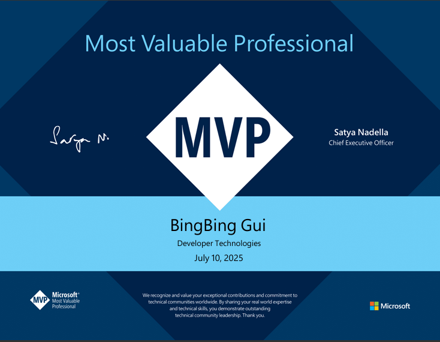
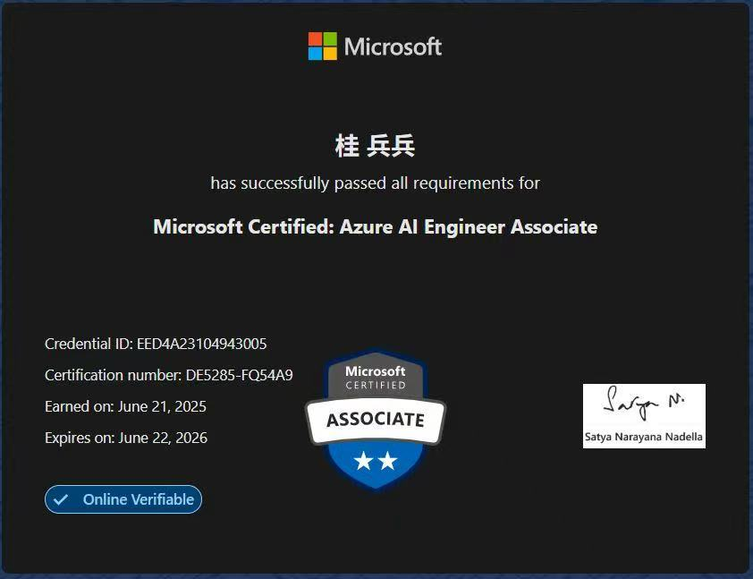

# 👋 欢迎来到我的技术博客

🧑‍💻 关于作者 桂兵兵（Bill Gui）的技术档案页，涵盖：个人简介、.NET / AI 技术栈、个人兴趣与认证成就。

---

    

---

## 👤 关于我 | About Me

- 🧑‍💻 **姓名**：桂兵兵（Bill Gui）  
- 🏷️ **技术标签**：.NET Architect、AI 开发者、开源协作者  
- 📍 **所在城市**：日本·东京  
- 🏢 **工作方向**：企业应用架构、AI 系统设计、前后端协作、Azure 云计算  

## 📚 擅长领域

- ASP.NET Core / ASP.NET Core MVC / WinForm / WPF / Dapper / EF Core  
- Postgres / MySql / SqlServer  
- Azure AI  
- Cognitive Search  
- OpenAI Solutions Architect  
- Azure AI Foundry  

---

## 📬 联系方式 | Contact

- 💼 GitHub: [@your-github](https://github.com/your-github)  
- 🌐 博客主页: [https://github.com/bingbing-gui](https://github.com/bingbing-gui)  
- 📮 邮箱: [bingbing.gui@outlook.com](mailto:bingbing.gui@outlook.com)  

---

## 🎯 兴趣爱好 | Interests

- 🧳 喜欢旅游：探索不同城市与文化，拓宽视野  
- 🏃 热爱跑步：享受专注与节奏带来的身心放松  
- 🏀 喜欢打篮球：热衷于团队合作与竞技挑战  
- 🎤 爱好唱歌：用音乐释放情绪，放松自我  

---

## 🏅 荣誉称号 | Recognition

> Microsoft MVP

- 授予：桂兵兵（Bill Gui）  
- 年度：2024–2026  
- 技术领域：Developer Technologies (.NET) 

> Microsoft Certified: Azure AI Engineer Associate

- 持证人：桂兵兵（Bill Gui）  
- 认证编号：AI-102  
- 颁发时间：2025 年  
- 认证内容：设计和实现 AI 解决方案，使用 Azure AI 服务，包括 Azure Cognitive Services、Bot Framework 和 OpenAI。
